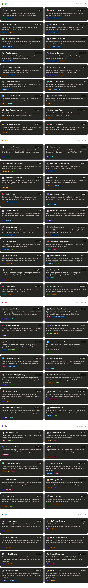

# 🤖 AutoTube AI — Your All-in-One Telegram Power Bot

> **A Python-powered Telegram bot that downloads YouTube & Instagram media, generates AI videos, chats with AI, transcribes audio — and keeps growing with every feature you throw at it.**

---

## 📋 Table of Contents

- [Project Overview](#-project-overview)
- [What's Built So Far](#-whats-built-so-far)
- [What You Can Build Next](#-what-you-can-build-next)
- [Architecture](#-architecture)
- [Prerequisites](#-prerequisites)
- [Installation](#-installation)
- [Configuration](#-configuration)
- [Running the Bot](#-running-the-bot)
- [Bot Commands](#-bot-commands)
- [Project Structure](#-project-structure)
- [Environment Variables](#-environment-variables)
- [Roadmap](#-roadmap)
- [License](#-license)

---

## 🎯 Project Overview

**AutoTube AI** is a multi-purpose Telegram bot designed to be a personal Swiss Army knife. Instead of switching between 10 apps or websites, you message one bot and get things done:

- 📥 Paste a YouTube link → get the video downloaded to your phone
- 📸 Paste an Instagram link → get the reel/post saved instantly
- 🎬 Describe a scene → get an AI-generated video
- 💬 Ask a question → get an AI-powered answer (Groq/LLaMA)
- 🎙️ Send audio → get a full transcription

**The vision:** One bot that keeps getting smarter. Every useful tool you wish existed — built into one Telegram interface.

---

## ✅ What's Built So Far

| Feature | Status | Command |
|---|---|---|
| YouTube video download (quality picker) | ✅ Done | `/ytDownloader` |
| YouTube direct download (paste link) | ✅ Done | Just paste a link |
| Instagram reel/post download | ✅ Done | `/instaDownloader` or paste link |
| AI chat (Groq + LLaMA) | ✅ Done | `/chat` |
| AI video generation (LTX Video) | ✅ Done | `/generateVideo` |
| Large file uploads to GoFile | ✅ Done | Auto (files > 50 MB) |
| Separate download folders | ✅ Done | `Youtube Downloads/` & `Instagram Downloads/` |

---

## 💡 What You Can Build Next: 

Here's a curated list of features that would make this bot incredibly powerful — organized by difficulty:

### 🟢 Easy Wins (1–2 hours each)

| Feature | Description | Command |
|---|---|---|
| 🎵 MP3 Extractor | Extract audio from YouTube, choose bitrate (128/320kbps). Auto-tags title and artist. | `/mp3` |
| 📝 Audio Transcription | Transcribe voice notes or audio via Whisper AI. Returns timestamped text + summary. | `/transcribe` |
| 🔗 URL Shortener | Shorten any URL via TinyURL or Bitly. Set custom alias. Show click stats. | `/shorten` |
| 🌐 Language Translator | Auto-detect source and translate to target. Supports 100+ languages via DeepL or LibreTranslate. | `/translate` |
| 📊 YouTube Video Info | Get title, views, likes, duration, thumbnail — no download needed. | `/ytinfo` |
| 🎲 Random Quote / Joke | Daily quotes, dad jokes, or programming humor. Choose category with inline buttons. | `/quote` |
| 🌤 Weather Lookup | Current weather + 3-day forecast for any city. Shows temp, humidity, wind, UV index. | `/weather` |
| 💱 Currency Converter | Convert between 170+ currencies with live rates. Supports BTC, ETH. | `/convert` |
| 📱 QR Code Generator | Generate QR codes for URLs, text, contact cards, or Wi-Fi credentials. Returns PNG. | `/qr` |
| 🔍 Image to Text (OCR) | Extract text from any image or screenshot using Tesseract or GPT Vision. | `/ocr` |
| 📚 Wikipedia Summary | Get a concise summary of any topic with a link to the full article. | `/wiki` |
| 🌍 IP / Domain Lookup | Geolocate any IP or WHOIS lookup for domains. Returns ISP, country, ASN. | `/ip` |
| 🔄 File Format Converter | Convert images between JPG/PNG/WebP or documents using FFmpeg or Pandoc. | `/fileconvert` |
| 🕐 Timezone World Clock | Check current time in any city, or convert between timezones. | `/time` |
| 🎨 Color Palette Generator | Generate palettes from a hex code or mood word. Returns hex, RGB, and preview image. | `/palette` |
| ⏱ Countdown Timer | Set a countdown to any date. Bot pings you at 1 week, 1 day, and 1 hour out. | `/countdown` |
| 🔐 Password Generator | Generate secure passwords with length and symbol controls. Scores strength. | `/genpass` |
| 🎯 Dice / Coin / Picker | Roll dice (D4–D20), flip a coin, or pick a random item from a list. | `/roll` |
---

### 🟡 Medium Effort (half-day each)

| Feature | Description | Command |
|---|---|---|
| 🖼 AI Image Generator | Generate images from text prompts via Stable Diffusion, DALL-E 3, or Pollinations API. | `/imagine` |
| 🗣 Text-to-Speech | Convert text to speech with 10+ voices via ElevenLabs or Google TTS. Returns MP3. | `/speak` |
| 📋 Personal Notes System | Save, tag, search, and retrieve notes. Export as PDF or .txt. | `/note` |
| 🔍 Web Search + Summarize | Query DuckDuckGo or SerpAPI, then use LLaMA to summarize top results. | `/search` |
| 📆 Reminders / Scheduler | Natural language reminders ("every Monday 9am") via APScheduler + SQLite. | `/remind` |
| 📄 PDF Tools | Merge, split, compress, rotate, watermark, or extract text from PDFs. | `/pdf` |
| 🧮 Code Runner | Execute Python, JS, Bash, or Go in a sandboxed Docker container. Returns stdout/stderr. | `/run` |
| 🎵 Spotify / SoundCloud DL | Download tracks from Spotify (spotdl), SoundCloud, or Deezer. Auto-embeds ID3 tags. | `/music` |
| 📰 News Summarizer | Top headlines from any topic, summarized by AI. Sources: BBC, Reuters, HN, Reddit. | `/news` |
| 📑 AI Document Analyzer | Upload a PDF/DOCX and ask questions about it using RAG. | `/analyze` |
| 😂 Meme Generator | Pick a template, enter text, get a meme back via Imgflip API (100+ templates). | `/meme` |
| 🖥 Website Screenshot | Full-page screenshot of any URL via Puppeteer. Returns high-res PNG. | `/screenshot` |
| 🐙 GitHub Tracker | Track commits, stars, and PRs. Set alerts for new releases or issues. | `/github` |
| 📲 Twitter/Reddit Downloader | Download videos and GIFs from Twitter/X, Reddit, TikTok, and Pinterest. | `/dl` |
| ✍ AI Writing Assistant | Rewrite, expand, shorten, or change tone. Modes: professional, casual, email, tweet thread. | `/write` |
| 📈 Crypto / Stock Tracker | Live prices, 24h change, charts. Set price-alert triggers via CoinGecko + Yahoo Finance. | `/price` |
| 💡 Explain Code | Paste any code — get a plain-English explanation, complexity analysis, and improvements. | `/explain` |
| 🧹 Background Remover | Remove backgrounds from photos using rembg (RIFE model). Returns transparent PNG. | `/rmbg` |
| 🩷 Sticker Maker | Convert any image to a Telegram sticker (512×512 WebP). Supports animated GIFs. | `/sticker` |
| 💸 Expense Tracker | Log expenses by category, set budgets, get visual spending breakdowns as charts. | `/expense` |
---

### 🔴 Big Features (1–3 days each)

| Feature | Description | Command |
|---|---|---|
| 🎬 Full Video Pipeline | Script → AI images → video → voiceover → captions → final render. Fully automated. | `/makevideo` |
| 📤 YouTube Auto-Upload | Upload videos to YouTube with AI-generated titles, descriptions, tags, and thumbnail. | `/upload` |
| 🤖 Multi-Model AI Chat | Switch between GPT-4, Claude Sonnet, Gemini 1.5, and LLaMA. Context preserved. | `/ai` |
| 👥 Multi-User + Admin Panel | User accounts, usage quotas, rate limiting, ban controls, and a FastAPI web dashboard. | `/admin` |
| 💰 Subscription System | Free tier + paid plans via Stripe or Razorpay. Auto-grants features on payment webhook. | `/premium` |
| 📊 Analytics Dashboard | Per-user stats, feature usage heatmaps, DAU, and download counts in Grafana/Chart.js. | `/stats` |
| 🔄 Cross-Platform Posting | Schedule and post to Instagram, Twitter/X, TikTok, and LinkedIn simultaneously. | `/autopost` |
| 🎙 Podcast Generator | Topic → AI script → multi-voice dialogue → intro music → exported MP3. | `/podcast` |
| 🧠 AI Persona + Long Memory | Custom AI persona with vector DB long-term memory of preferences and past chats. | `/persona` |
| ⚙ Workflow Automation | Build If-This-Then-That automations (e.g. BTC drops 5% → alert + tweet). | `/workflow` |
| 📋 Resume / CV Builder | Answer guided questions → AI generates polished resume + cover letter. Exports PDF. | `/resume` |
| 🏗 Group AI Chatbot Builder | Create topic-specific mini-bots within the bot (e.g. a custom cooking expert). | `/createbot` |
| 💬 Auto Subtitles for Video | Whisper-generated subtitles burned into any video. Choose font style and language. | `/captions` |
| 🛒 Price Drop Tracker | Monitor Amazon/Flipkart product URLs for price drops. Notifies at target price. | `/track` |
---

### 🟣 Power User & Group Features

| Feature | Description | Command |
|---|---|---|
| 🗳 Rich Polls + Voting | Multi-option polls, ranked-choice votes, or anonymous surveys with live result charts. | `/poll` |
| 🧾 Group Expense Splitter | Track group trip/dinner expenses, calculate settlements, share summary. | `/split` |
| 🎭 Anonymous Confessions | Submit messages anonymously; bot posts to group channel with moderation queue. | `/confess` |
| 🧩 Quiz / Trivia Game | AI-generated or Open Trivia DB questions with leaderboards, streaks, and timed rounds. | `/quiz` |
| ✅ Group Task Manager | Assign tasks to members, set due dates, track completion — like Trello inside Telegram. | `/task` |
| 🎥 Shared Watchlist | Add movies/shows, see IMDB ratings and streaming availability, vote on what's next. | `/watchlist` |
| 🛡 Auto-Moderation | Auto-welcome members, delete spam, mute users via AI toxicity detection. | `/mod` |
| 🎂 Birthday Tracker | Register birthdays; bot sends AI-written greetings at midnight automatically. | `/birthday` |
| 📓 Habit Tracker | Define habits, check in daily, see streak stats and weekly heatmaps with AI nudges. | `/habit` |
| 🔗 Referral System | Unique invite links with rewards (bonus credits or premium features) for referrals. | `/invite` |

---

### 🩵 AI Superchargers — next-level intelligence

| Feature | Description | Command |
|---|---|---|
| 🍱 AI Meal Planner | Input diet, allergies, calorie goal → weekly meal plan + shopping list + recipes. | `/meal` |
| 🧘 AI Wellness Check-in | CBT-style AI companion for journaling, venting, and daily mood tracking. | `/talk` |
| 🎓 AI Study Buddy | Upload notes → AI generates flashcards, quiz, or concept map. Spaced repetition reminders. | `/study` |
| 💼 Business Idea Generator | Describe your skills → AI brainstorms ideas, validates them, and drafts a one-page plan. | `/idea` |
| 📧 AI Email Drafter | Describe what you want to say → AI writes a polished email in your chosen tone. | `/email` |
| ♻ Content Repurposer | Paste a YouTube/blog URL → AI adapts it into tweet thread, LinkedIn post, newsletter, and caption. | `/repurpose` |
| 🕵 AI Research Agent | Multi-step agent: searches web, reads pages, synthesizes findings into a cited report. | `/research` |
| 🌙 Dream Journal | Log dreams by voice or text. AI analyzes symbols, tracks patterns, stores in private journal. | `/dream` |

---

## 🏗 Tech Stack

| Layer | Technology |
|---|---|
| Bot Framework | `python-telegram-bot` |
| AI / LLM | Groq + LLaMA, OpenAI, Anthropic |
| Video Download | `yt-dlp` |
| Video Generation | LTX Video |
| Large File Storage | GoFile API |
| Audio Transcription | OpenAI Whisper |
| Background Removal | `rembg` |
| PDF Processing | PyMuPDF |
| Database | SQLite / PostgreSQL |
| Scheduler | APScheduler |
| Payments | Stripe / Razorpay |

---

## 🏗 Architecture

```
┌─────────────────────────────────────────────────────────────┐
│                     TELEGRAM BOT LAYER                      │
│              Aiogram 3.x  |  FSM  |  Handlers              │
└──────────────────────────┬──────────────────────────────────┘
                           │
              ┌────────────┼────────────────┐
              ▼            ▼                ▼
     ┌──────────────┐ ┌──────────┐ ┌──────────────────┐
     │  DOWNLOADERS │ │  AI CHAT │ │  VIDEO GENERATOR  │
     │              │ │          │ │                   │
     │ yt-dlp       │ │ Groq API │ │ LTX Video API     │
     │ YouTube      │ │ LLaMA    │ │ FFmpeg            │
     │ Instagram    │ │          │ │                   │
     └──────────────┘ └──────────┘ └──────────────────┘
              │
              ▼
     ┌──────────────────────────────────────────┐
     │              DELIVERY LAYER              │
     │  Telegram Upload  |  GoFile (large files) │
     └──────────────────────────────────────────┘
```

---

## ⚙️ Prerequisites

- Python 3.11+
- FFmpeg installed and in PATH
- A Telegram Bot Token (from [@BotFather](https://t.me/BotFather))
- Groq API key (free tier available at [console.groq.com](https://console.groq.com))

---

## 🚀 Installation

### 1. Clone the Repository

```bash
git clone https://github.com/yourname/autotube-ai.git
cd autotube-ai
```

### 2. Install uv (fast Python package manager)

```bash
# Windows (PowerShell)
powershell -ExecutionPolicy ByPass -c "irm https://astral.sh/uv/install.ps1 | iex"

# macOS / Linux
curl -LsSf https://astral.sh/uv/install.sh | sh
```

### 3. Create Virtual Environment & Install Dependencies

```bash
uv venv
uv pip install -r requirements.txt
```

### 4. Install FFmpeg

```bash
# Windows — use winget or download from https://ffmpeg.org
winget install FFmpeg

# macOS
brew install ffmpeg

# Ubuntu/Debian
sudo apt update && sudo apt install -y ffmpeg

# Verify
ffmpeg -version
```

### 5. Set Up Environment Variables

```bash
cp .env.example .env
# Edit .env with your API keys
```

---

## 🔧 Configuration

Copy `.env.example` to `.env` and fill in the required values:

```env
# ── Required ──────────────────────────────────────────────
TELEGRAM_BOT_TOKEN=your_bot_token_from_botfather
GROQ_API_KEY=your_groq_api_key

# ── Optional (for extended features) ─────────────────────
OPENAI_API_KEY=your_openai_key
ELEVENLABS_API_KEY=your_elevenlabs_key
```

> **Minimum setup:** You only need `TELEGRAM_BOT_TOKEN` and `GROQ_API_KEY` to get the bot running with downloads + AI chat.

---

## ▶️ Running the Bot

```bash
# Activate virtual environment (if not using uv run)
.venv\Scripts\activate   # Windows
source .venv/bin/activate  # macOS/Linux

# Start the bot
uv run python bot/main.py
```

The bot will start polling for messages. Open your bot in Telegram and send `/start`!

---

## 🤖 Bot Commands

| Command | Description |
|---|---|
| `/start` | Initialize the bot and see the welcome message |
| `/chat` | Start a conversation with AI (Groq/LLaMA) |
| `/ytDownloader` | Download a YouTube video with quality selection |
| `/instaDownloader` | Download an Instagram reel or post |
| `/generateVideo` | Generate an AI video from a text prompt |
| `/transcribe` | Transcribe audio or video to text |
| `/help` | Show all available commands |

**Pro tip:** You can also just paste a YouTube or Instagram link directly — the bot auto-detects it and starts downloading!

---

## 📁 Project Structure

```
autotube-ai/
├── bot/
│   ├── main.py                    # Bot entry point, dispatcher, FSM states
│   ├── utilities.py               # Shared helpers (GoFile upload, etc.)
│   └── handlers/
│       ├── chat.py                # /chat — AI conversation handler
│       ├── directDownloader.py    # Auto-detect YT/IG links, download best quality
│       ├── ytDownloader.py        # /ytDownloader — quality picker flow
│       ├── instaDownloader.py     # /instaDownloader handler
│       ├── generateVideo.py       # /generateVideo — AI video generation
│       ├── transcribe.py          # /transcribe handler
│       └── start.py               # /start handler
│
├── workers/                       # Celery background workers (future)
│   ├── celery_app.py
│   ├── intelligence_tasks.py
│   ├── generation_tasks.py
│   ├── assembly_tasks.py
│   └── upload_tasks.py
│
├── models/
│   └── pipeline_job.py            # Job model (future pipeline use)
│
├── Youtube Downloads/             # Downloaded YouTube videos (gitignored)
├── Instagram Downloads/           # Downloaded Instagram media (gitignored)
│
├── k8s/                           # Kubernetes manifests (future)
├── Dockerfile                     # Container setup
├── docker-compose.yml             # Dev environment
├── docker-compose.prod.yml        # Production environment
├── requirements.txt               # Python dependencies
├── pyproject.toml                 # Project metadata
├── .env.example                   # Environment variable template
├── .gitignore                     # Git exclusions
└── README.md                      # You are here
```

---

## 🔑 Environment Variables

| Variable | Required | Description |
|---|---|---|
| `TELEGRAM_BOT_TOKEN` | ✅ | Bot token from @BotFather |
| `GROQ_API_KEY` | ✅ | Groq API key for AI chat |
| `OPENAI_API_KEY` | ❌ | OpenAI key (for future image/audio gen) |
| `ELEVENLABS_API_KEY` | ❌ | ElevenLabs key (for future TTS) |

---

## 🗺 Roadmap

- [x] **v0.1** — YouTube downloader with quality picker
- [x] **v0.2** — Instagram downloader
- [x] **v0.3** — AI chat integration (Groq/LLaMA)
- [x] **v0.4** — AI video generation (LTX Video)
- [x] **v0.5** — Direct link detection (auto-download on paste)
- [ ] **v0.6** — Audio transcription (Whisper)
- [ ] **v0.7** — AI image generation
- [ ] **v0.8** — Text-to-speech
- [ ] **v0.9** — PDF tools & web search
- [ ] **v1.0** — Multi-user support + usage tracking
- [ ] **v1.5** — Full video pipeline (script → render → upload)
- [ ] **v2.0** — Web dashboard + subscription system

---

## 🤝 Contributing

This is a personal project, but ideas and PRs are welcome! Open an issue to discuss before submitting major changes.

---

## 📄 License

MIT License — see [LICENSE](LICENSE) for details.

---

*Built with Python 3.11+, Aiogram 3.x, yt-dlp, Groq AI, and a lot of ambition. 🚀*
